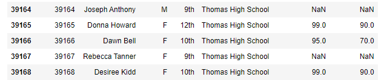
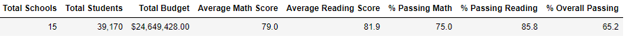
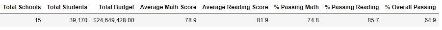
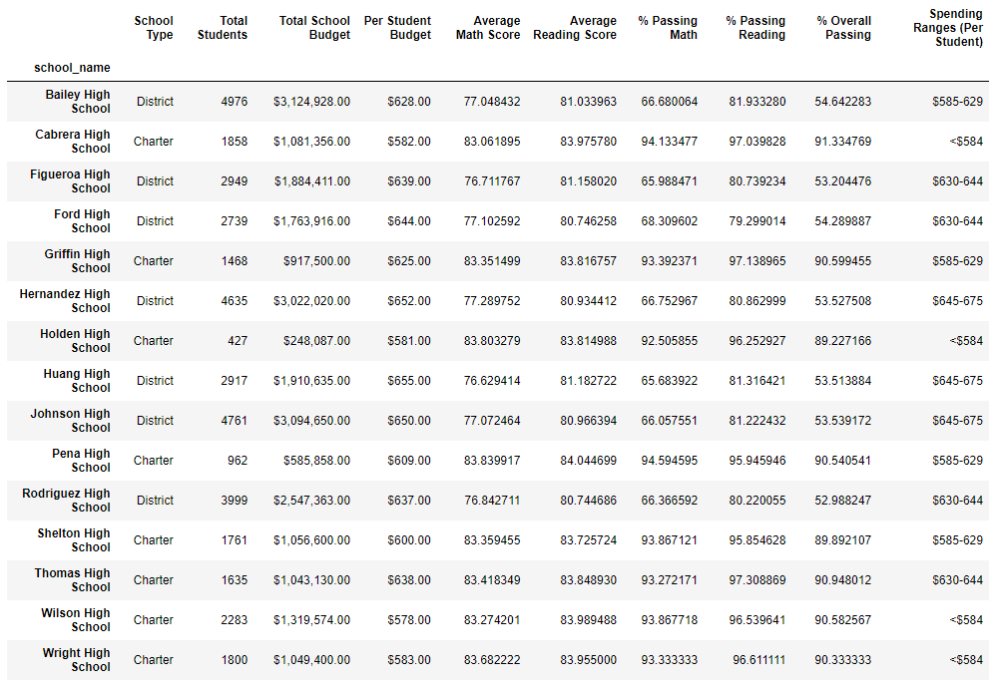
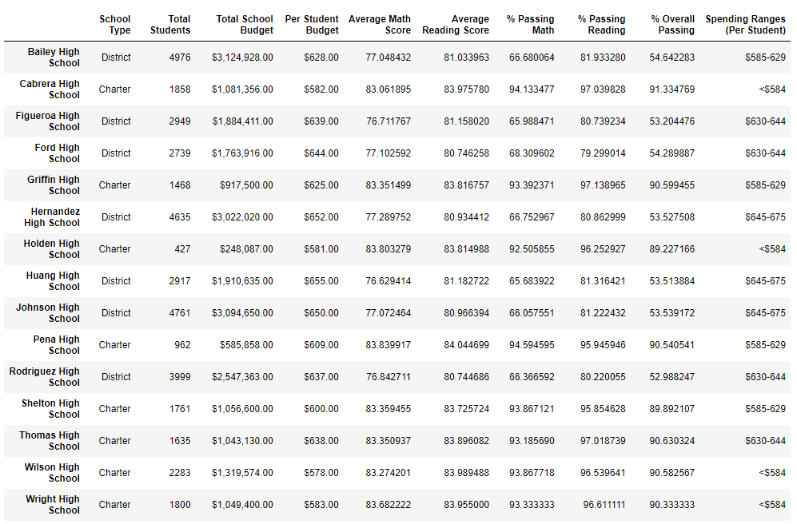
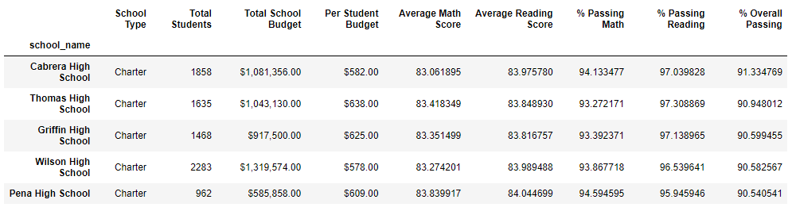
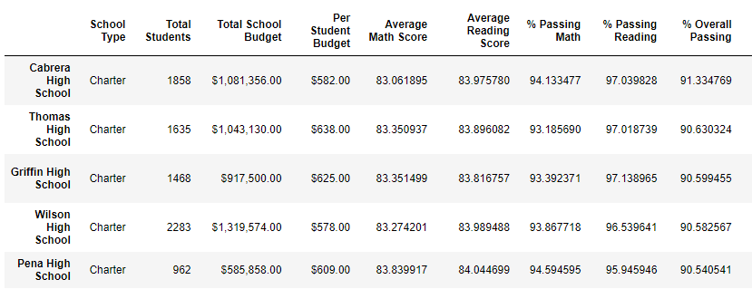

# School District Analysis

## Project Overview
In this project, we have performed an analysis of key metrics for various schools within a district to compare their school performance based on budget, school size, and type of school. 

The school board was concerned that there may have been academic dishonesty regarding the math and reading scores for ninth graders at Thomas High School. To ensure any potentially fraudulent or deceitful scores do not interfere with our analysis, the scores for those students have been converted to NaN (or "Not a Number") and the analysis was performed without those scores. A comparison was drawn to compare the data analysis before and after the scores had been dropped from the data. 

## Resources
- Data source: schools_complete.csv and students_complete.csv (included in this repository)
- Software: Python 3.7.6, Pandas 1.2.4, NumPy 1.20.1, Jupyter Notebook 6.3.0, and Visual Studio Code 1.61.0

## Results
By replacing the 461 Thomas High School ninth graders scores with "NaN," we were able to maintain the student data for the purposes of total students in a school and per capita spending. This allowed us to keep Thomas High School in the correct ranges for size and spending, without impacting the average math and reading scores, along with the percentage of students passing the exams.

//bulleted list, use images of dataframes
- how is the district summary affected
(Before images pulled from PyCitySchools file, after images pulled from PyCitySchools_Challenge file)

- how is the school summary affected

- how does replacing ninth graders math and reading scores affect Thomas High School's performance relative to other schools?

- how does replacing the ninth graders scores affect the following;
    - math and reading scores by grade
    - scores by school spending
    - scores by school size
    - scores by school type

## Summary

//summarize four changes in the updated district analysis after scores are replaced with NaNs