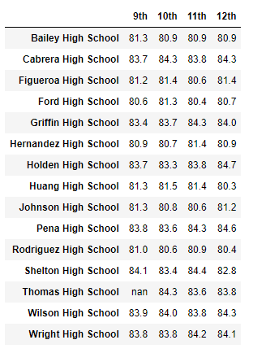

# School District Analysis

## Project Overview
In this project, we have performed an analysis of key metrics for various schools within a district to compare their school performance based on budget, school size, and type of school. 

The school board was concerned that there may have been academic dishonesty regarding the math and reading scores for ninth graders at Thomas High School. To ensure any potentially fraudulent or deceitful scores do not interfere with our analysis, the scores for those students have been converted to "NaN" (or "Not a Number") and the analysis was performed without those scores. A comparison was drawn to compare the data analysis before and after the scores had been dropped from the data to see if this has any significant impact on our summaries. 

## Resources
- Data source: schools_complete.csv and students_complete.csv (included in this repository)
- Software: Python 3.7.6, Pandas 1.2.4, NumPy 1.20.1, Jupyter Notebook 6.3.0, and Visual Studio Code 1.61.0

## Results
By replacing the math and reading scores of 461 Thomas High School ninth graders with "NaN," we were able to maintain the student data for the purposes of total students in a school and per capita spending. This allowed us to keep Thomas High School in the correct ranges for size and spending, without impacting the average math and reading scores, along with the percentage of students passing both exams.

An example of a "NaN" score showing up in our data, seen for J. Anthony and R. Tanner:

Let's examine how each summary was impacted by the replaced scores. The "before" images indicate data as it appeared including all students, as seen in the PyCitySchools.ipynb file. The "after" images indicate data as it appeared after replacing Thomas High School ninth graders scores with "NaN" and was taken from the PyCitySchools_Challenge.ipynb file. 

- **District Summary**  
    These images reflect a district-wide summary of the average scores and percentage of students passing each exam, before and after removing scores of Thomas High School ninth graders.

    

    

    Our district summary had minimal changes, only reflecting changes within 0.3 percentage points. The average scores did not change by more than 0.1. 

    As the district summary used data from all 39,170 students, removing only 461 did not have a very substantial impact on this summary. 

- **School Summary**  
These images reflect a summary based on each school, before and after removing scores of Thomas High School ninth graders.

As the summary for each of the schools used the same data before and after the replacing of the scores, these two charts reflect identical data other than the data for Thomas High School.

The average scores changed 0.06 points or less, and the averages (once corrected to true averages being divided by only the valid data points) changed by 0.3 percentage points or less. 

Even removing a quarter of the students from the school data (461 out of 1635) had minimal impact on the average scores, indicating that the ninth graders scores were reasonable compared to the other students in the same school, and do not appear to be outliers or raise any questions on their own.

- **Thomas High School's Performance Relative to Other Schools**  
These images reflect the top 5 schools based on percentage of students passing both reading and math (% Overall Passing), before and after removing scores of Thomas High School ninth graders.

Without removing the ninth graders scores, Thomas High School is the second highest performing school in the district (when using overall passing percentage as a metric). After removing the scores and accounting for the new total number of students, the overall passing percentage for Thomas High School keeps it in its place as second highest in the district. 

All schools maintain their relative rankings, and dropping the ninth graders scores do not have an impact on Thomas High School's performance relative to other schools in the district. 

- **Math and Reading Scores by Grade**  
The math and reading scores by grade are not impacted, other than the summary table not being able to display the 9th grader averages for Thomas High School. Instead, "NaN" appears. No other data is affected. 

- **Scores by School Spending**  
As only the spending range containing Thomas High School ($630-644) was impacted, the majority of this summary is unaffected. As Thomas High School is one of four schools in this budget range, the impact is minimal. We see only two changes of 0.1 percentage points, and the average scores are not any different. 

- **Scores by School Size**  
Small and large school data did not include any dropped scores, so only the medium school summary has any changes. Like with other summaries, these changes are minimal. After rounding to the nearest tenth, the changes are not even noticeable. The percentage of students passing the reading test changed by 0.6, enough to change the rounded value by 0.1. Otherwise, the data was not affected.

- **Scores by School Type**  
Thomas High School is a charter school, like half of the schools in this district. The summary for charter schools shows no noticeable changes when rounded to the nearest tenth. This is likely due to the even smaller ratio of students that Thomas High School ninth graders make up of the total number of students in charter schools (compared to medium sized schools or schools spending between $630 and $644 per student). 

## Summary
Replacing the scores of Thomas High School ninth graders only removed around 1% of our student data (461/39170, or 1.18%). As such, much of our analysis was not impacted, especially with analyses of the full group of students. More obvious changes were seen when comparing only a small subset, like schools based on ranges of spending or size, but even these results only changed by a fraction of percentage points and were not significant. 

The main impact was the additional work that removing these scores created, as our percentage of passing scores for Thomas High School students was dramatically thrown off. Before accounting for the reduction in total students and manually adjusting the mean, our percentage of students appearing to pass both the reading and writing for Thomas High school dropped to 65%, making it an average-performing school (with 7 other schools with a lower overall passing percentage, and 7 schools with higher overall passing percentages). After factoring in only 10th-12th grade students for the total student divisor, Thomas High School's overall passing percentage changed to 90.6%, much higher than the 65% we saw when only counting passing 10th-12th graders out of the total 9th-12th grade student population. 

| School Name                           | Average Math Score | Average Reading Score | % Passing Math | % Passing Reading | % Passing Both |
| -------------                         | :-------------:  | :-------------:    | :-------------:  | :-------------:   | :-------------:  |
| Thomas High School (Automatic Mean)     | 83.4  | 83.9 | 66.9 | 69.7 | 65.1 |
| Thomas High School (Manual Mean)  | 83.4 | 83.9 | 93.2 | 97.0 | 90.6 |
| Thomas High School (All Students)  | 83.4 | 83.8 | 93.3 | 97.3 | 90.9 |

Without dropping the 9th grader scores, the school's overall passing percentage was 90.9%. We can see that there was not a significant difference between removing the 9th graders scores in terms of the percentage of students that passed both the reading and writing tests. This may be an indication that the scores were typical for the student population and that no academic dishonesty occurred. (Of course, pending additional investigation.)

The average scores for the math test and the reading test separately for Thomas High School students were within half a point (and for the reading test, within five hundredths of a point), further indicating that the scores for 9th graders at Thomas High School were close to the average for the 10th-12th graders at the same school. 

Across the whole district, dropping the Thomas High School 9th graders scores only impacted the average math score by 0.1, and did not impact the average reading score (at least when rounded to the nearest tenth of a point). With this in mind, we can be confident in our decision to convert the scores of ninth graders at Thomas High School to "NaN" to perserve academic integrity and portray the district's data honestly. 

